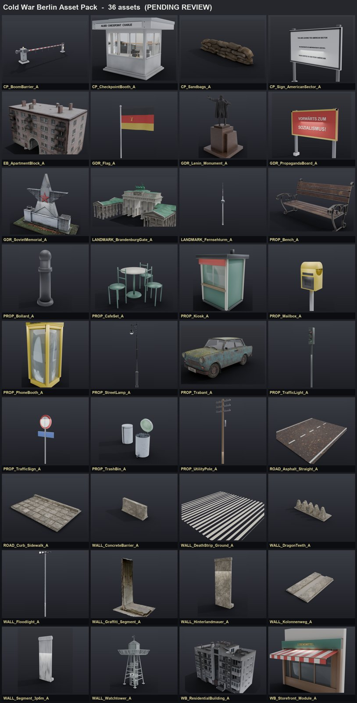

# Cold War Berlin Asset Pack

1970–80년대 냉전 베를린(1989년 이전, 동독 존속기)을 배경으로 만든 게임 에셋 팩.
FPS 맵 제작을 위해 **한 번에 하나씩** 만들고 매번 사람이 검수하는 규칙으로 축적했다.

- 규격: **1 Blender Unit = 1 m**, +Z up, 원점 = 접지면 중심, 트랜스폼 적용 완료
- 포함: `exports/` 아래 **GLB 192개** (Git LFS)
- 실측 제원과 제작 노트는 [`docs/asset_manifest.csv`](docs/asset_manifest.csv),
  [`docs/asset_notes.md`](docs/asset_notes.md)



## 무엇이 들어있나

| 카테고리 | 내용 |
|---|---|
| Berlin_Wall_Border_Zone | 장벽 세그먼트(그래피티/후면벽), 감시탑, 지휘탑, 콜로넨베크 순찰로, 체코 고슴도치, 조명탑 |
| Checkpoint_Charlie | 검문소 부스, "YOU ARE LEAVING THE AMERICAN SECTOR" 표지판, 차단봉, 모래주머니 |
| East/West_Berlin_Architecture | 플라텐바우 아파트, 알트바우, 상점 전면 모듈, 창호 모듈 |
| GDR_Socialist_Symbols | 레닌 기념비, 소비에트 전승 기념비, 프로파간다 보드, 동독 국기 |
| Landmarks | 브란덴부르크문, 전승기념탑, 페른제투름 |
| Roads / Vehicles / Props | 아스팔트·연석·보도, 트라반트, 전화부스, 키오스크, 가로등, 신호등, 벤치, 우체통 |

전체 목록은 아래 표 참조.

## 사용법

```bash
git lfs install
git clone https://github.com/ShootTheMoon/coldwar-berlin-assetpack.git
```
LFS를 설치하지 않으면 `.glb`가 텍스트 포인터로 받아진다.

엔진별 임포트 주의사항은 [`docs/import_notes_unreal_unity.md`](docs/import_notes_unreal_unity.md).
OVERDARE(Roblox 계열)로 넣을 때는 30k 트라이앵글 분할과 MeshPart당 텍스처 1장 제한이 있어
[overdare-map-pipeline](https://github.com/ShootTheMoon/overdare-map-pipeline)의 변환기를 거쳐야 한다.

## 라이선스

- **모델·텍스처**: [CC BY 4.0](https://creativecommons.org/licenses/by/4.0/) (`LICENSE-ASSETS`)
- 일부 에셋은 Sketchfab의 **CC-BY** 모델에서 파생했다. 원저작자와 UID를 [`ATTRIBUTION.md`](ATTRIBUTION.md)에
  전부 명시했으며, 이 팩을 쓰는 쪽도 해당 표기를 함께 유지해야 한다.
- 일부는 Hunyuan3D로 생성한 뒤 손질한 것이고, 나머지는 직접 모델링·절차적 생성이다.
  구분은 `docs/asset_notes.md`의 각 항목 `Source method`에 적혀 있다.

## 에셋 목록

| 에셋 | 카테고리 | 실크기 (m) | 트라이앵글 | 머티리얼 |
|---|---|---|---:|---:|
| `WALL_BorderColumn_A` | Berlin_Wall_Border_Zone | 0.22x0.22x2.05 | 109 | 5 |
| `WALL_CommandTower_A` | Berlin_Wall_Border_Zone | 2.70x2.70x11.28 | 254 | 5 |
| `WALL_ConcreteBarrier_A` | Berlin_Wall_Border_Zone | 2.00x0.58x0.90 | 92 | 1 |
| `WALL_Corner_A` | Berlin_Wall_Border_Zone | 1.51x1.51x3.52 | 580 | 2 |
| `WALL_CzechHedgehog_A` | Berlin_Wall_Border_Zone | 1.78x1.69x1.57 | 36 | 1 |
| `WALL_DeathStrip_Ground_A` | Berlin_Wall_Border_Zone | 4.00x4.00x0.03 | 12,800 | 1 |
| `WALL_DragonTeeth_A` | Berlin_Wall_Border_Zone | 4.40x1.40x1.07 | 440 | 1 |
| `WALL_Floodlight_A` | Berlin_Wall_Border_Zone | 1.40x0.60x8.18 | 1,920 | 4 |
| `WALL_Gate_A` | Berlin_Wall_Border_Zone | 4.16x0.50x3.64 | 210 | 3 |
| `WALL_Graffiti_Segment_A` | Berlin_Wall_Border_Zone | 2.53x1.95x3.59 | 37,794 | 1 |
| `WALL_Hinterlandmauer_A` | Berlin_Wall_Border_Zone | 1.24x0.49x3.10 | 132 | 1 |
| `WALL_Kolonnenweg_A` | Berlin_Wall_Border_Zone | 2.40x4.00x0.16 | 420 | 3 |
| `WALL_Segment_3p6m_A` | Berlin_Wall_Border_Zone | 1.20x0.58x3.62 | 676 | 1 |
| `WALL_SignalFence_A` | Berlin_Wall_Border_Zone | 2.74x0.24x2.40 | 67 | 3 |
| `WALL_VehicleTrench_A` | Berlin_Wall_Border_Zone | 6.00x4.00x1.28 | 42 | 2 |
| `WALL_Watchtower_A` | Berlin_Wall_Border_Zone | 3.03x3.03x11.55 | 1,656 | 2 |
| `PROP_SectorSign_A` | Checkpoint | 3.10x0.30x3.00 | 32 | 3 |
| `CP_BoomBarrier_A` | Checkpoint_Charlie | 5.85x0.60x1.31 | 1,252 | 4 |
| `CP_CheckpointBooth_A` | Checkpoint_Charlie | 3.76x3.23x2.95 | 80,186 | 14 |
| `CP_Flagpole_US_A` | Checkpoint_Charlie | 2.02x0.52x8.31 | 900 | 4 |
| `CP_GuardPost_A` | Checkpoint_Charlie | 1.46x1.46x2.43 | 143 | 6 |
| `CP_LaneStripes_A` | Checkpoint_Charlie | 3.20x4.00x0.02 | 52 | 2 |
| `CP_Sandbags_A` | Checkpoint_Charlie | 2.00x0.32x0.45 | 19,975 | 1 |
| `CP_Sign_AmericanSector_A` | Checkpoint_Charlie | 3.50x0.36x3.62 | 38,569 | 1 |
| `CP_SpikeStrip_A` | Checkpoint_Charlie | 3.50x0.34x0.18 | 324 | 3 |
| `EB_ApartmentBlock_A` | East_Berlin_Architecture | 32.0x19.1x21.5 | 22,027 | 1 |
| `EB_CentrumWarenhaus_A` | East_Berlin_Architecture | 41.50x29.50x24.00 | 188 | 5 |
| `EB_FactoryVEB_A` | East_Berlin_Architecture | 28.20x16.20x20.00 | 76 | 5 |
| `EB_GarageRow_A` | East_Berlin_Architecture | 17.80x5.95x2.81 | 84 | 9 |
| `EB_Gartenlaube_A` | East_Berlin_Architecture | 4.49x4.00x5.34 | 118 | 9 |
| `EB_HausDesLehrers_A` | East_Berlin_Architecture | 28.36x22.36x38.80 | 36 | 5 |
| `EB_KMATower_A` | East_Berlin_Architecture | 19.00x19.00x57.30 | 794 | 7 |
| `EB_KarlMarxAlleeBlock_A` | East_Berlin_Architecture | 26.80x14.80x23.75 | 28 | 5 |
| `EB_KarlMarxAllee_Module_A` | East_Berlin_Architecture | 3.20x0.34x3.54 | 100 | 4 |
| `EB_Kaufhalle_A` | East_Berlin_Architecture | 24.60x14.73x5.70 | 136 | 7 |
| `EB_Kaufhaus_A` | East_Berlin_Architecture | 24.30x20.30x16.20 | 34 | 4 |
| `EB_KinoInternational_A` | East_Berlin_Architecture | 35.80x18.00x14.70 | 141 | 6 |
| `EB_PlattenbauBlock_A` | East_Berlin_Architecture | 30.40x13.40x15.60 | 52 | 5 |
| `EB_PlattenbauTower_A` | East_Berlin_Architecture | 14.30x15.85x44.20 | 40 | 4 |
| `EB_Plattenbau_Balcony_A` | East_Berlin_Architecture | 2.53x1.44x1.07 | 72 | 3 |
| `EB_Plattenbau_Entrance_A` | East_Berlin_Architecture | 2.50x1.10x2.85 | 108 | 5 |
| `EB_Plattenbau_Panel_A` | East_Berlin_Architecture | 2.50x0.30x2.80 | 96 | 5 |
| `EB_Plattenbau_Roof_A` | East_Berlin_Architecture | 2.56x2.06x0.60 | 78 | 5 |
| `EB_Schule_A` | East_Berlin_Architecture | 36.40x18.60x11.80 | 59 | 7 |
| `EB_Tankstelle_A` | East_Berlin_Architecture | 16.45x11.00x6.42 | 155 | 9 |
| `EB_TrafoHaus_A` | East_Berlin_Architecture | 3.60x3.53x4.40 | 86 | 7 |
| `EB_ViaductArch_A` | East_Berlin_Architecture | 8.20x4.37x9.10 | 216 | 4 |
| `GDR_Ampelmann_A` | GDR_Socialist_Symbols | 0.34x0.26x2.72 | 62 | 4 |
| `GDR_BannerVertical_A` | GDR_Socialist_Symbols | 1.40x0.33x4.10 | 180 | 2 |
| `GDR_Flag_A` | GDR_Socialist_Symbols | 2.32x0.27x6.12 | 1,152 | 5 |
| `GDR_KonsumSign_A` | GDR_Socialist_Symbols | 2.44x0.23x0.52 | 2,311 | 3 |
| `GDR_Lenin_Monument_A` | GDR_Socialist_Symbols | 2.96x3.23x5.48 | 9,929 | 2 |
| `GDR_MosaicMural_A` | GDR_Socialist_Symbols | 3.06x0.17x2.02 | 31 | 2 |
| `GDR_Obelisk_A` | GDR_Socialist_Symbols | 1.40x1.40x4.38 | 103 | 5 |
| `GDR_PropagandaBoard_A` | GDR_Socialist_Symbols | 3.20x0.37x3.05 | 10,692 | 5 |
| `GDR_ReviewingStand_A` | GDR_Socialist_Symbols | 4.64x3.08x3.48 | 184 | 6 |
| `GDR_RooftopSlogan_A` | GDR_Socialist_Symbols | 10.64x0.38x2.36 | 4,422 | 2 |
| `GDR_SovietMemorial_A` | GDR_Socialist_Symbols | 5.50x2.42x4.56 | 474,802 | 1 |
| `GDR_StateEmblem_A` | GDR_Socialist_Symbols | 1.12x0.32x3.11 | 1,116 | 3 |
| `GDR_FlagArray_A` | GDR_Symbols | 9.60x0.80x7.30 | 531 | 5 |
| `GDR_SovietMemorial_Treptow_A` | GDR_Symbols | 10.00x10.00x8.78 | 2,798 | 3 |
| `PROP_MemorialPlinth_A` | GDR_Symbols | 5.00x4.00x2.95 | 175 | 5 |
| `PROP_NoticeCase_A` | GDR_Symbols | 1.60x0.30x1.88 | 40 | 6 |
| `LANDMARK_BerlinerDom_A` | Landmarks | 31.00x29.00x38.30 | 3,258 | 5 |
| `LANDMARK_BrandenburgGate_A` | Landmarks | 65.0x31.4x29.0 | 390,218 | 11 |
| `LANDMARK_Church_A` | Landmarks | 12.95x29.50x28.40 | 173 | 6 |
| `LANDMARK_Fernsehturm_A` | Landmarks | 33.4x33.4x368.0 | 3,236 | 5 |
| `LANDMARK_Fountain_A` | Landmarks | 3.40x3.40x2.01 | 1,704 | 2 |
| `LANDMARK_Funkturm_A` | Landmarks | 15.45x15.45x67.57 | 1,368 | 4 |
| `LANDMARK_GlienickeBridge_A` | Landmarks | 35.00x8.20x7.03 | 642 | 3 |
| `LANDMARK_KaiserWilhelmChurch_A` | Landmarks | 35.67x17.37x46.35 | 324 | 4 |
| `LANDMARK_PalastDerRepublik_A` | Landmarks | 51.00x31.00x18.75 | 28 | 5 |
| `LANDMARK_Reichstag_A` | Landmarks | 51.00x32.80x29.00 | 182 | 5 |
| `LANDMARK_UBahnEntrance_A` | Landmarks | 3.25x3.51x3.87 | 268 | 6 |
| `LANDMARK_VictoryColumn_A` | Landmarks | 27.85x27.91x67.0 | 399,947 | 1 |
| `LANDMARK_WaterTower_A` | Landmarks | 23.00x23.00x38.20 | 449 | 4 |
| `LANDMARK_Weltzeituhr_A` | Landmarks | 1.80x1.80x4.35 | 3,939 | 5 |
| `PROP_RailSignal_A` | Roads_Infrastructure | 0.50x0.58x5.25 | 222 | 7 |
| `PROP_RailTrack_A` | Roads_Infrastructure | 10.00x4.05x0.76 | 242 | 7 |
| `PROP_RoadBarrier_A` | Roads_Infrastructure | 2.40x0.95x1.55 | 144 | 5 |
| `PROP_SBahnPlatform_A` | Roads_Infrastructure | 16.20x4.00x4.62 | 186 | 8 |
| `PROP_StreetNameSign_A` | Roads_Infrastructure | 0.96x0.28x2.60 | 44 | 3 |
| `PROP_TrafficLight_A` | Roads_Infrastructure | 3.35x0.63x5.11 | 286 | 7 |
| `PROP_TramOverheadMast_A` | Roads_Sidewalks | 7.00x3.15x7.38 | 153 | 4 |
| `PROP_TramStopIsland_A` | Roads_Sidewalks | 8.00x1.60x2.56 | 84 | 5 |
| `PROP_TreeGrate_A` | Roads_Sidewalks | 1.74x1.74x0.10 | 30 | 2 |
| `ROAD_Asphalt_Straight_A` | Roads_Sidewalks | 7.00x8.00x0.07 | 96 | 2 |
| `ROAD_CobbleStreet_A` | Roads_Sidewalks | 8.00x8.00x0.07 | 6 | 1 |
| `ROAD_Crosswalk_A` | Roads_Sidewalks | 5.85x4.00x0.02 | 84 | 1 |
| `ROAD_Curb_Sidewalk_A` | Roads_Sidewalks | 4.01x2.80x0.30 | 2,236 | 1 |
| `ROAD_Curve_A` | Roads_Sidewalks | 8.15x8.15x0.08 | 342 | 2 |
| `ROAD_Intersection_A` | Roads_Sidewalks | 8.00x8.00x0.08 | 78 | 2 |
| `ROAD_ManholeCover_A` | Roads_Sidewalks | 0.72x0.72x0.07 | 1,500 | 1 |
| `ROAD_PlazaPaving_A` | Roads_Sidewalks | 6.00x6.00x0.07 | 6 | 1 |
| `ROAD_TJunction_A` | Roads_Sidewalks | 8.00x8.00x0.08 | 90 | 2 |
| `ROAD_TramTrack_A` | Roads_Sidewalks | 2.60x8.00x0.12 | 42 | 3 |
| `PROP_BandstandPavilion_A` | Vehicles_Props | 7.39x8.14x6.45 | 441 | 6 |
| `PROP_BarkasB1000_A` | Vehicles_Props | 4.43x1.91x1.93 | 668 | 8 |
| `PROP_BeerCrates_A` | Vehicles_Props | 0.89x0.65x0.54 | 1,908 | 7 |
| `PROP_Bench_A` | Vehicles_Props | 1.80x1.02x1.05 | 21,940 | 1 |
| `PROP_BicycleRack_A` | Vehicles_Props | 4.00x0.92x1.12 | 454 | 2 |
| `PROP_Bicycle_A` | Vehicles_Props | 1.52x0.49x0.86 | 49,483 | 7 |
| `PROP_BikeRack_A` | Vehicles_Props | 2.58x0.70x0.75 | 360 | 2 |
| `PROP_Billboard_A` | Vehicles_Props | 5.10x1.38x4.24 | 49 | 3 |
| `PROP_Bollard_A` | Vehicles_Props | 0.30x0.30x0.92 | 668 | 1 |
| `PROP_BusIkarus280_A` | Vehicles_Props | 2.94x16.50x3.14 | 128,326 | 55 |
| `PROP_BusShelter_A` | Vehicles_Props | 3.70x1.72x2.40 | 90 | 5 |
| `PROP_BusShelter_A` | Vehicles_Props | 4.24x2.13x3.00 | 147 | 7 |
| `PROP_BusStopSign_A` | Vehicles_Props | 0.52x0.20x2.84 | 43 | 3 |
| `PROP_CafeAchteck_A` | Vehicles_Props | 3.60x3.60x4.30 | 189 | 4 |
| `PROP_CafeSet_A` | Vehicles_Props | 1.16x1.60x0.87 | 1,088 | 2 |
| `PROP_CarTrailer_A` | Vehicles_Props | 2.71x1.69x1.03 | 212 | 6 |
| `PROP_CarpetRack_A` | Vehicles_Props | 3.18x0.40x1.79 | 80 | 3 |
| `PROP_ChainBarrier_A` | Vehicles_Props | 4.69x0.20x0.94 | 2,248 | 1 |
| `PROP_ChessTable_A` | Vehicles_Props | 0.85x2.42x0.90 | 94 | 3 |
| `PROP_Chimney_A` | Vehicles_Props | 0.74x0.66x1.59 | 212 | 3 |
| `PROP_CigaretteMachine_A` | Vehicles_Props | 0.64x0.32x1.76 | 91 | 5 |
| `PROP_Clothesline_A` | Vehicles_Props | 5.16x0.55x1.85 | 142 | 7 |
| `PROP_Clothesline_A` | Vehicles_Props | 4.10x0.90x2.00 | 178 | 8 |
| `PROP_CoalBriquettes_A` | Vehicles_Props | 1.20x1.75x0.72 | 4,758 | 2 |
| `PROP_ConcreteBench_A` | Vehicles_Props | 1.66x0.68x0.99 | 78 | 2 |
| `PROP_ConstructionFence_A` | Vehicles_Props | 4.10x0.22x2.17 | 61 | 3 |
| `PROP_Crates_A` | Vehicles_Props | 1.71x0.56x0.68 | 318 | 3 |
| `PROP_DoubleDeckerBus_A` | Vehicles_Props | 11.19x2.77x5.10 | 238 | 9 |
| `PROP_Dumpster_A` | Vehicles_Props | 1.28x1.02x1.13 | 170 | 4 |
| `PROP_Fence_A` | Vehicles_Props | 2.60x0.10x1.60 | 1,168 | 1 |
| `PROP_FerrisWheel_A` | Vehicles_Props | 16.70x4.00x17.17 | 972 | 7 |
| `PROP_FireHydrant_A` | Vehicles_Props | 0.38x0.39x0.98 | 672 | 3 |
| `PROP_FlowerBox_A` | Vehicles_Props | 1.03x0.25x0.36 | 730 | 6 |
| `PROP_GardenFence_A` | Vehicles_Props | 3.23x0.12x1.19 | 180 | 2 |
| `PROP_GasLantern_A` | Vehicles_Props | 0.42x0.48x4.28 | 627 | 4 |
| `PROP_Hedge_A` | Vehicles_Props | 3.24x0.70x1.24 | 532 | 2 |
| `PROP_ImbissCart_A` | Vehicles_Props | 2.64x2.64x2.96 | 3,102 | 7 |
| `PROP_JeepUAZ469_A` | Vehicles_Props | 1.77x4.00x2.09 | 12,488 | 2 |
| `PROP_Kiosk_A` | Vehicles_Props | 1.96x1.78x2.75 | 660 | 6 |
| `PROP_Kiosk_A` | Vehicles_Props | 2.50x2.85x2.66 | 162 | 12 |
| `PROP_LadaVAZ2103_A` | Vehicles_Props | 1.76x4.10x1.42 | 76,609 | 73 |
| `PROP_LindenTree_A` | Vehicles_Props | 7.00x7.10x9.94 | 684 | 2 |
| `PROP_LitfassColumn_A` | Vehicles_Props | 1.40x1.40x3.45 | 688 | 4 |
| `PROP_LitfassColumn_A` | Vehicles_Props | 1.72x1.72x3.95 | 145 | 3 |
| `PROP_Mailbox_A` | Vehicles_Props | 0.44x0.32x1.61 | 804 | 3 |
| `PROP_Mailbox_A` | Vehicles_Props | 0.50x0.39x1.68 | 151 | 6 |
| `PROP_MarketStall_A` | Vehicles_Props | 2.70x1.27x2.41 | 477 | 6 |
| `PROP_Motorcycle_A` | Vehicles_Props | 2.08x0.76x1.10 | 260 | 8 |
| `PROP_Multicar_A` | Vehicles_Props | 3.60x1.54x2.22 | 394 | 9 |
| `PROP_NewspaperCase_A` | Vehicles_Props | 1.70x0.34x2.20 | 67 | 4 |
| `PROP_OilBarrel_A` | Vehicles_Props | 0.61x0.61x0.88 | 460 | 1 |
| `PROP_Pallet_A` | Vehicles_Props | 1.24x0.84x0.13 | 120 | 2 |
| `PROP_PanelStack_A` | Vehicles_Props | 4.77x6.27x3.79 | 114 | 4 |
| `PROP_ParkCandelabra_A` | Vehicles_Props | 1.16x1.16x4.06 | 2,743 | 3 |
| `PROP_PedestrianRail_A` | Vehicles_Props | 2.14x0.14x1.18 | 174 | 2 |
| `PROP_PhoneBooth_A` | Vehicles_Props | 1.02x1.04x2.48 | 6,428 | 4 |
| `PROP_PhoneBooth_A` | Vehicles_Props | 1.12x1.14x2.62 | 120 | 6 |
| `PROP_Pissoir_A` | Vehicles_Props | 2.31x2.31x2.98 | 139 | 4 |
| `PROP_Planter_A` | Vehicles_Props | 1.20x0.44x0.84 | 384 | 3 |
| `PROP_Playground_A` | Vehicles_Props | 8.13x2.66x2.60 | 254 | 7 |
| `PROP_RooftopAntenna_A` | Vehicles_Props | 1.27x1.10x2.03 | 652 | 2 |
| `PROP_RooftopNeon_A` | Vehicles_Props | 12.07x0.27x4.16 | 286 | 4 |
| `PROP_RubbleHeap_A` | Vehicles_Props | 2.10x1.78x0.77 | 330 | 5 |
| `PROP_SBahnCar_A` | Vehicles_Props | 19.00x3.04x4.03 | 256 | 6 |
| `PROP_Scaffolding_A` | Vehicles_Props | 5.18x1.08x6.24 | 446 | 4 |
| `PROP_Scooter_A` | Vehicles_Props | 0.89x1.80x1.42 | 120,000 | 1 |
| `PROP_SiteContainer_A` | Vehicles_Props | 6.12x2.69x2.88 | 120 | 7 |
| `PROP_StreetClock_A` | Vehicles_Props | 0.74x0.44x3.87 | 163 | 3 |
| `PROP_StreetClock_A` | Vehicles_Props | 1.24x0.70x4.45 | 112 | 3 |
| `PROP_StreetLampPost_A` | Vehicles_Props | 0.32x2.02x6.12 | 108 | 3 |
| `PROP_StreetLamp_A` | Vehicles_Props | 0.73x0.33x5.00 | 7,810 | 2 |
| `PROP_StreetNameSign_A` | Vehicles_Props | 1.69x0.25x0.30 | 1,586 | 3 |
| `PROP_T34Tank_A` | Vehicles_Props | 9.33x3.65x2.82 | 427 | 5 |
| `PROP_TowerCrane_A` | Vehicles_Props | 26.06x4.00x28.27 | 1,734 | 5 |
| `PROP_Trabant_A` | Vehicles_Props | 1.51x3.55x1.44 | 91,248 | 3 |
| `PROP_TrafficCone_A` | Vehicles_Props | 0.32x0.32x0.52 | 316 | 3 |
| `PROP_TrafficLight_A` | Vehicles_Props | 0.30x0.40x3.80 | 1,592 | 4 |
| `PROP_TrafficSign_A` | Vehicles_Props | 0.84x0.20x2.50 | 1,180 | 4 |
| `PROP_TrafficSigns_A` | Vehicles_Props | 0.59x0.18x2.91 | 31 | 4 |
| `PROP_TramTatraT3_A` | Vehicles_Props | 2.76x14.00x4.87 | 192,843 | 58 |
| `PROP_TrashBin_A` | Vehicles_Props | 0.95x0.65x0.74 | 5,568 | 1 |
| `PROP_Tree_A` | Vehicles_Props | 6.0x6.1x8.0 | 12,533 | 4 |
| `PROP_TruckGAZ53_A` | Vehicles_Props | 2.46x6.40x2.40 | 45,277 | 25 |
| `PROP_UtilityCabinet_A` | Vehicles_Props | 1.06x0.51x1.40 | 90 | 6 |
| `PROP_UtilityPole_A` | Vehicles_Props | 1.80x0.53x8.10 | 2,156 | 3 |
| `PROP_VendingMachine_A` | Vehicles_Props | 0.61x0.54x1.96 | 41 | 4 |
| `PROP_Wartburg353_A` | Vehicles_Props | 4.30x1.82x1.43 | 692 | 7 |
| `PROP_WasteContainer_A` | Vehicles_Props | 1.85x1.29x1.67 | 108 | 4 |
| `PROP_WaterPump_A` | Vehicles_Props | 0.42x0.81x1.77 | 1,161 | 3 |
| `PROP_WaterPump_A` | Vehicles_Props | 0.70x1.66x2.28 | 165 | 4 |
| `PROP_Downpipe_A` | West_Berlin_Architecture | 0.32x0.44x4.97 | 134 | 2 |
| `PROP_RollerShutter_A` | West_Berlin_Architecture | 2.60x0.33x2.31 | 318 | 2 |
| `WB_AltbauBuilding_A` | West_Berlin_Architecture | 22.60x14.60x19.90 | 46 | 5 |
| `WB_AltbauRowhouse_A` | West_Berlin_Architecture | 12.40x13.40x16.60 | 34 | 6 |
| `WB_Altbau_Base_A` | West_Berlin_Architecture | 1.46x0.35x2.78 | 156 | 4 |
| `WB_Altbau_Corner_A` | West_Berlin_Architecture | 0.67x0.67x2.80 | 90 | 2 |
| `WB_Balcony_Module_A` | West_Berlin_Architecture | 2.60x1.30x1.65 | 1,256 | 2 |
| `WB_CornerBuilding_A` | West_Berlin_Architecture | 22.56x18.56x25.70 | 71 | 6 |
| `WB_Cornice_Module_A` | West_Berlin_Architecture | 1.46x0.31x0.84 | 108 | 2 |
| `WB_Door_Module_A` | West_Berlin_Architecture | 1.80x0.46x3.20 | 296 | 5 |
| `WB_ModernSlab_A` | West_Berlin_Architecture | 33.55x14.00x20.00 | 118 | 7 |
| `WB_ResidentialBuilding_A` | West_Berlin_Architecture | 22.0x13.0x16.2 | 276,674 | 5 |
| `WB_Storefront_Module_A` | West_Berlin_Architecture | 4.05x1.55x3.60 | 3,536 | 7 |
| `WB_Window_Module_A` | West_Berlin_Architecture | 1.40x0.47x2.40 | 792 | 3 |